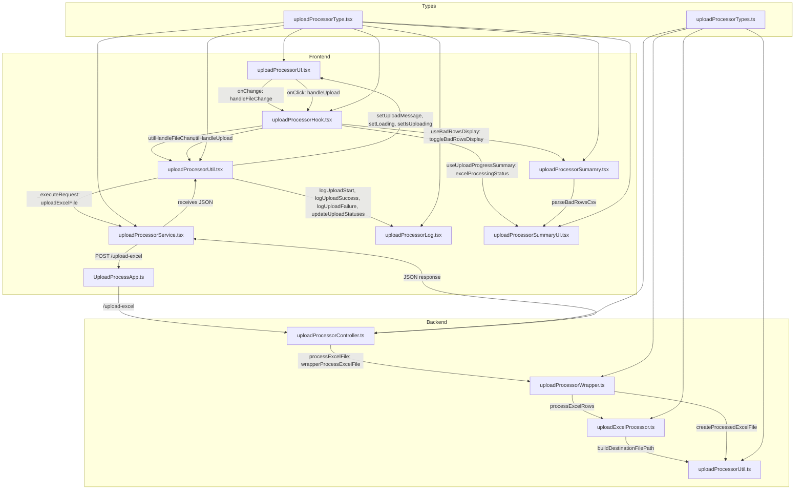

# Upload and Process Flow

This diagram illustrates the flow of the "Upload and Process" functionality in the application, detailing how frontend and backend files interact when a user uploads an Excel file and clicks the "Upload and Process" button. The flow covers file selection, API calls, Excel processing, file operations, and result display.

## Key Points
- **Frontend to Backend**: Uses Axios POST requests (`uploadProcessorService.tsx`) to `/upload-excel` endpoint (`UploadProcessApp.ts`).
- **Backend to Frontend**: Returns JSON responses via Express, processed by `uploadProcessorUtil.tsx`.
- **Critical Functions**:
  - Frontend: `handleFileChange`, `handleUpload`, `_executeRequest`, `uploadExcelFile`, `logUpload*`, `updateUploadStatuses`, `parseBadRowsCsv`.
  - Backend: `processExcelFile`, `wrapperProcessExcelFile`, `processExcelRows`, `buildDestinationFilePath`, `createProcessedExcelFile`.
- **Type Safety**: `uploadProcessorType.tsx` and `uploadProcessorTypes.ts` ensure consistent data structures.